# mycobot450_isaacsim

`mycobot450_isaacsim` is an Isaac Sim / ROS 2 / MoveIt 2 integration repository for **myCobot Pro 450**. It aims to provide:

- Pro450 URDF model and ROS 2 description package
- Joint state publishing and joint command subscription in Isaac Sim 4.5.0
- Hardware–Isaac Sim co-simulation
- Basic control: sliders, model following, GUI, keyboard teleop
- MoveIt 2 planning and execution bridge to Isaac Sim

## 1 Quick start

If this is your first time with the repo, follow this order:

1. Install ROS 2 Humble and Isaac Sim 4.5.0  
2. Create a ROS 2 workspace and clone this repository  
3. `colcon build` all packages  
4. Start Isaac Sim 4.5.0  
5. Open the USD scene from the repo  
6. Click `Play` in Isaac Sim  
7. Start basic control nodes or MoveIt 2 as needed  

Minimal example:

```bash
mkdir -p ~/pro450_isaacsim_ws/src
cd ~/pro450_isaacsim_ws/src
git clone https://github.com/elephantrobotics/mycobot450_isaacsim.git

cd ~/pro450_isaacsim_ws
source /opt/ros/humble/setup.bash
colcon build
source install/setup.bash
```

## 2 Prerequisites

Before using the examples, confirm the following:

- **Hardware**  
  - MyCobot Pro 450 arm  
  - Ethernet cable (robot to Host)  
  - Power supply  
  - Emergency stop (for safe operation)

- **Software and environment**  
  - OS: `Ubuntu 22.04`  
  - GPU: discrete NVIDIA GPU recommended (validated on `RTX 3080`, `10GB` VRAM)  
  - `Python 3.10` or newer  
  - `ROS 2 Humble`  
  - `NVIDIA Isaac Sim 4.5.0` or newer — see [Isaac Sim download and install](https://docs.isaacsim.omniverse.nvidia.com/4.5.0/installation/download.html)  
  - `pymycobot` (`pip install pymycobot`)  
  - Pro 450 powered on and idle  
  - **Note:** The Pro 450 server stack starts automatically after power-on; no manual start required  

- **Network**  
  - Default robot IP: `192.168.0.232`  
  - Default port: `4500`  
  - **Note:** Set the host NIC to the **same subnet** (e.g. `192.168.0.xxx` where `xxx` is 2–254 and not in conflict with the robot).

  - Example:  
    - Robot IP: `192.168.0.232`  
    - Host IP: `192.168.0.100`  
    - Subnet mask: `255.255.255.0`  
    - DNS: `114.114.114.114`  

  - **Check:** After configuration, from the host run:

    ```bash
    ping 192.168.0.232
    ```

    If replies return, the link is OK.

---

## 3 Repository layout

```text
mycobot450_isaacsim/
├── README.md
├── LICENSE
├── mycobot_description/
│   ├── package.xml
│   ├── setup.py
│   ├── meshes/
│   └── urdf/
│       └── mycobot_pro_450/
│           └── mycobot_pro_450.urdf
├── pro450_isaacsim/
│   ├── package.xml
│   ├── setup.py
│   ├── config/
│   │   └── pro450_isaacsim.rviz
│   ├── launch/
│   │   ├── teleop_keyboard.launch.py
│   │   └── test.launch.py
│   └── pro450_isaacsim/
│       ├── slider_control.py
│       ├── follow_display.py
│       ├── simple_gui.py
│       ├── teleop_keyboard.py
│       └── usd/
│           └── mycobot_pro_450.usd
├── pro450_isaac_moveit2/
│   ├── package.xml
│   ├── CMakeLists.txt
│   ├── config/
│   └── launch/
│       ├── isaac_moveit.launch.py
│       ├── move_group.launch.py
│       ├── moveit_rviz.launch.py
│       ├── rsp.launch.py
│       ├── static_virtual_joint_tfs.launch.py
│       ├── demo.launch.py
│       └── ...
└── pro450_isaac_moveit2_control/
    ├── package.xml
    ├── setup.py
    └── pro450_isaac_moveit2_control/
        └── isaac_sync_plan.py
```

## 4 Package overview

### `mycobot_description`

ROS 2 description for Pro450:

- URDF model  
- Mesh assets  
- Robot description for `robot_state_publisher`, MoveIt 2, and Isaac Sim import  

Key file:

- `mycobot_description/urdf/mycobot_pro_450/mycobot_pro_450.urdf`

### `pro450_isaacsim`

Isaac Sim basics:

- Joint sliders: `slider_control.py`  
- Follow display: `follow_display.py`  
- GUI: `simple_gui.py`  
- Keyboard: `teleop_keyboard.py`, `teleop_keyboard.launch.py`  

Typical commands:

- `ros2 run pro450_isaacsim slider_control`
- `ros2 run pro450_isaacsim follow_display`
- `ros2 run pro450_isaacsim simple_gui`
- `ros2 run pro450_isaacsim teleop_keyboard`
- `ros2 launch pro450_isaacsim teleop_keyboard.launch.py`

### `pro450_isaac_moveit2`

MoveIt 2 configuration:

- SRDF / kinematics / joint limits / controllers  
- `move_group`  
- `robot_state_publisher`  
- RViz launch  
- Isaac-focused entry: `isaac_moveit.launch.py`

### `pro450_isaac_moveit2_control`

MoveIt 2 execution bridge:

- `isaac_sync_plan.py`  

Converts MoveIt `FollowJointTrajectory` execution into what Isaac accepts:

- `/joint_command`
- `sensor_msgs/msg/JointState`

Optional sync to the real Pro450.

## 5 Install and build

This repo is **ROS 2 workspace source**, not a standalone binary. Clone into a workspace, build, then use `ros2 run` / `ros2 launch`.

Suggested layout:

```text
~/pro450_isaacsim_ws/
├── src/
│   └── mycobot450_isaacsim/
├── build/
├── install/
└── log/
```

Create and build (open a terminal with <kbd>Ctrl</kbd>+<kbd>Alt</kbd>+<kbd>T</kbd>):

```bash
mkdir -p ~/pro450_isaacsim_ws/src
cd ~/pro450_isaacsim_ws/src
git clone https://github.com/elephantrobotics/mycobot450_isaacsim.git

cd ~/pro450_isaacsim_ws
source /opt/ros/humble/setup.bash
colcon build
source install/setup.bash
```

Build selected packages only:

```bash
cd ~/pro450_isaacsim_ws
source /opt/ros/humble/setup.bash
colcon build --packages-select pro450_isaacsim
colcon build --packages-select pro450_isaac_moveit2 pro450_isaac_moveit2_control
source install/setup.bash
```

## 6 Start Isaac Sim and open the USD scene

### Isaac Sim install path

Example install path:

```bash
/home/er/.local/share/ov/pkg/isaac_sim-4.5.0
```

Use your actual install location.

### Launch Isaac Sim

>> **Use your real install directory.**

From the install folder, use the official script:

```bash
cd /home/er/.local/share/ov/pkg/isaac_sim-4.5.0
./isaac-sim.sh
```

**Note:** First launch can take a long time (~3 minutes) while the renderer and core modules initialize. If you see a dialog like:

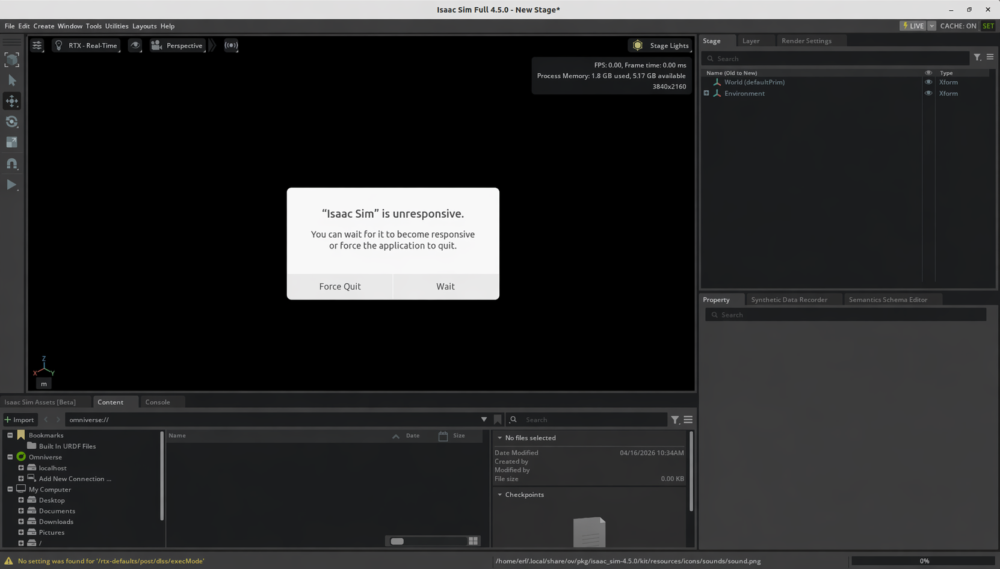

do **not** force quit; **wait**. When Isaac Sim is ready you should see GPU info, for example:

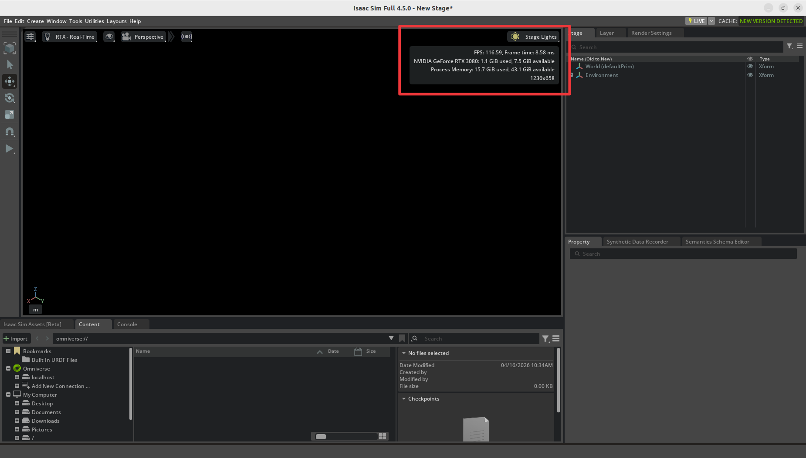

Terminal log should include:

```bash
Isaac Sim Full App is loaded
```

If ROS 2 is sourced in your shell, you can run before Isaac Sim:

```bash
source /opt/ros/humble/setup.bash
```

### Open the USD file

Recommended: open the bundled USD:

```text
pro450_isaacsim/pro450_isaacsim/usd/mycobot_pro_450.usd
```

If the repo is at:

```text
~/pro450_isaacsim_ws/src/mycobot450_isaacsim
```

a typical full path is:

```text
~/pro450_isaacsim_ws/src/mycobot450_isaacsim/pro450_isaacsim/pro450_isaacsim/usd/mycobot_pro_450.usd
```

In Isaac Sim:

1. Start `./isaac-sim.sh`  
2. `File -> Open`  
3. Open `mycobot_pro_450.usd`  
4. Wait for the stage to load  
5. Click `Play`  

Demo:

<video id="my-video" class="video-js" controls preload="auto" width="100%"
poster="" data-setup='{"aspectRatio":"16:9"}'>

<source src="./resources/video/isaacsim_import_usd.mp4">
</video>

## 7 Isaac Sim configuration

### Importing the model

Two approaches:

1. Re-import the URDF from `mycobot_description` into Isaac Sim and tune your own USD (set per-joint `Max Force`, `Damping`, `Stiffness`).  
2. Open the pre-authored USD: `pro450_isaacsim/pro450_isaacsim/usd/mycobot_pro_450.usd`.

For quick ROS 2 / MoveIt 2 / hardware checks, prefer the bundled USD.

### Action Graph (recommended)

Include at least:

- `ROS2 Context`  
- `On Playback Tick`  
- `Isaac Read Simulation Time`  
- `ROS2 Publish Joint State`  
- `ROS2 Subscribe Joint State`  
- `Articulation Controller`  
- Optional: `ROS2 Publish Clock`  

Suggested topics:

- Publish sim joint state: `/joint_states`  
- Receive joint commands: `/joint_command`  
- Optional clock: `/clock`  

### Important prim paths

Easy to misconfigure.

#### `ROS2 Publish Joint State`

Point to a prim that exposes joint state, e.g.:

- `/mycobot_pro450/base`

#### `Articulation Controller`

Point to the **articulation root**, not a child link, e.g.:

- `/mycobot_pro450/base`

If wrong, you may see:

- `Pattern '/mycobot_pro450' did not match any rigid bodies`  
- `Provided pattern list did not match any articulations`  
- `NoneType object has no attribute link_names`  

### Physics Inspector

- After loading the USD: `Tools -> Physics -> Physics Inspector`  

    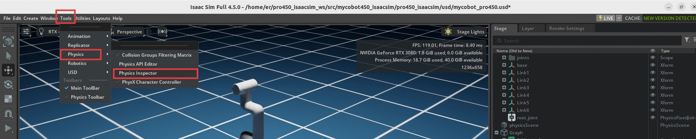

- In the panel, click the **arrow** tool  

    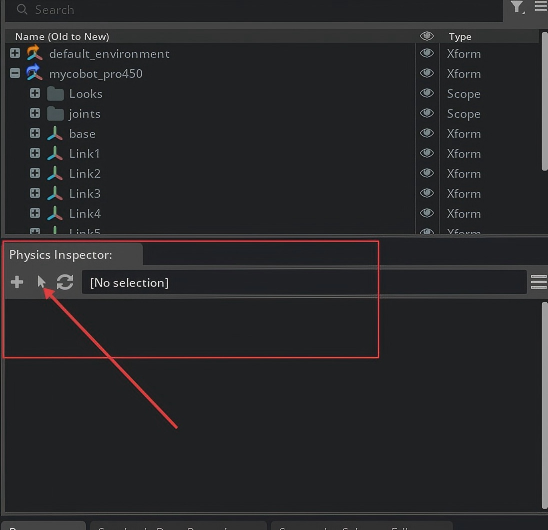

- In the dialog, choose `Articulation`  

    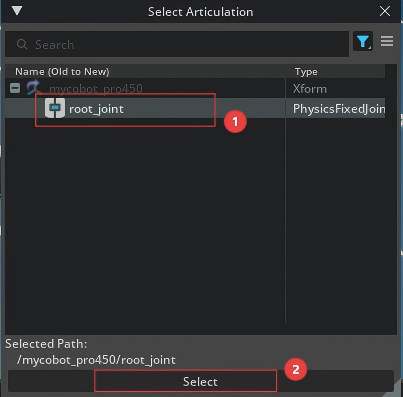

- You can drag joints to move the articulation:  

    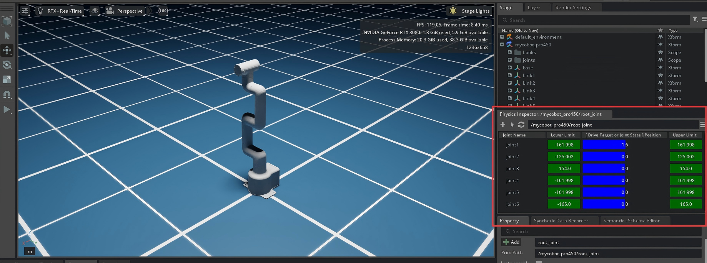

- Close Physics Inspector:  

    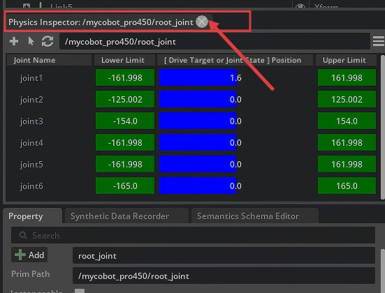

`Physics Inspector` and `Articulation Controller` both drive the same articulation.

Therefore:

- Publishing only `joint_states`: Inspector dragging is usually fine.  
- ROS control via `Subscribe + Articulation Controller`: **close Inspector** to avoid conflicts.

Otherwise you may get:

- `Simulation view object is invalidated and cannot be used again`  
- `Articulation Controller` errors  
- Competing control on the articulation  

## 8 Basic features

>> **Note:** **All examples assume the USD scene is already open in Isaac Sim.** Path: `mycobot450_isaacsim/pro450_isaacsim/pro450_isaacsim/usd/mycobot_pro_450.usd`

### 1. Slider follow control

<video id="my-video" class="video-js" controls preload="auto" width="100%"
poster="" data-setup='{"aspectRatio":"16:9"}'>

<source src="./resources/video/isaacsim_slider.mp4">
</video>

- After loading the USD, open **Physics Inspector**  
- Click `Play` in Isaac Sim  
- Syncs Isaac / ROS joint state to the robot. In a terminal:

```bash
ros2 run pro450_isaacsim slider_control --ros-args -p ip:=192.168.0.232 -p port:=4500
```

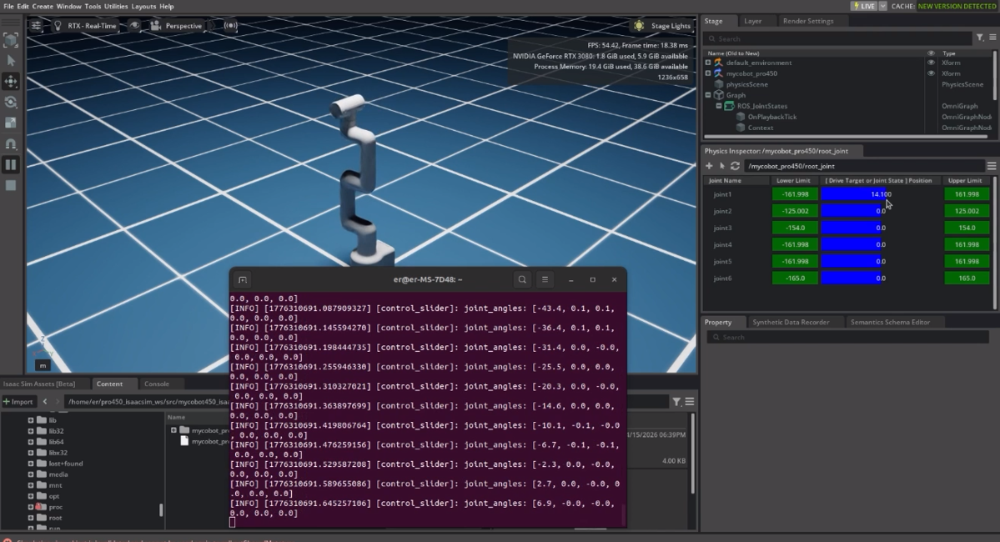

When running, dragging joints in **Inspector** moves both sim and hardware.

**Important: when the command starts, the arm moves toward the current Isaac pose. Ensure the Isaac model is not intersecting geometry before starting.**

**Do not snap sliders quickly while connected to the real arm — risk of damage.**

Notes:

- The node subscribes joint state and calls `send_angles`  
- Suited to simple joint dragging  

### 2. Model follow display

Let the sim model follow the real arm.

<video id="my-video" class="video-js" controls preload="auto" width="100%"
poster="" data-setup='{"aspectRatio":"16:9"}'>

<source src="./resources/video/isaacsim_follow_display.mp4">
</video>

- Load the USD (**close Physics Inspector**)  
- Click `Play`  
- Publishes real joint angles toward Isaac. Run:

```bash
ros2 run pro450_isaacsim follow_display --ros-args -p ip:=192.168.0.232 -p port:=4500
```

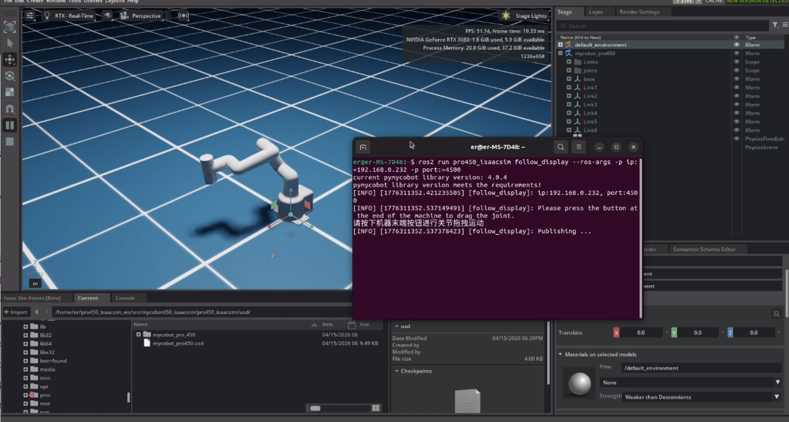

Per terminal instructions, hold the end-effector button and drag joints on the robot; Isaac follows.

### 3. GUI control

Simple GUI on top of the same stack.

<video id="my-video" class="video-js" controls preload="auto" width="100%"
poster="" data-setup='{"aspectRatio":"16:9"}'>

<source src="./resources/video/isaacsim_gui.mp4">
</video>

- Load the USD (**close Physics Inspector**)  
- Click `Play`  
- Run:

```bash
ros2 run pro450_isaacsim simple_gui --ros-args -p ip:=192.168.0.232 -p port:=4500
```

Enter angles / coordinates and use the buttons to sync robot and sim.

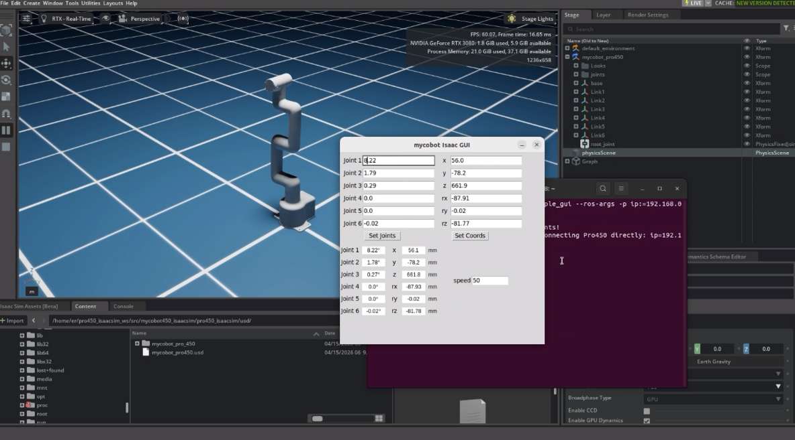

Notes:

- Angle mode publishes target joint angles directly to Isaac  
- Coordinate mode sends the real robot first, then syncs Isaac from reported angles  
- Short polling + GUI refresh resend improves coordinate sync  

### 4. Keyboard teleop

Keyboard control in `pro450_isaacsim`, synced in Isaac Sim. Uses the Python API — connect the real arm.

<video id="my-video" class="video-js" controls preload="auto" width="100%"
poster="" data-setup='{"aspectRatio":"16:9"}'>

<source src="./resources/video/isaacsim_teleop_keyboard.mp4">
</video>

- Load the USD (**close Physics Inspector**)  
- Click `Play`  
- Run:

```bash
ros2 launch pro450_isaacsim teleop_keyboard.launch.py ip:=192.168.0.232 port:=4500
```

A new terminal opens with output similar to:

```bash
Mycobot Teleop Keyboard Controller
---------------------------
Movimg options(control coordinations [x,y,z,rx,ry,rz]):
              w(x+)

    a(y-)     s(x-)     d(y+)

    z(z-) x(z+)

u(rx+)   i(ry+)   o(rz+)
j(rx-)   k(ry-)   l(rz-)

+/- : Increase/decrease movement step size

Other:
    1 - Go to init pose
    2 - Go to home pose
    3 - Resave home pose
    q - Quit
```

Use that terminal for interactive keys.

**Note: press `2` so the arm goes home before Cartesian control. Example logs:**

```bash
[WARN] [1758001794.385321]: Coordinate control disabled. Please press '2' first.
[INFO] [1758001804.552778]: Home pose reached. Coordinate control enabled.
[INFO] [1758001817.069637]: Home pose reached. Coordinate control enabled.
[WARN] [1758001836.301070]: Returned to zero. Press '2' to enable coordinate control.
[WARN] [1758001848.830702]: Coordinate control disabled. Please press '2' first.
[INFO] [1758001863.383565]: Home pose reached. Coordinate control enabled.
[WARN] [1758001933.596504]: Returned to zero. Press '2' to enable coordinate control.
[WARN] [1758001942.051899]: Coordinate control disabled. Please press '2' first.
```

Notes:

- The keyboard node talks to Pro450 directly  
- `send_angles` updates Isaac immediately  
- `send_coords` depends on reported angles to sync Isaac  
- Launch uses `x-terminal-emulator -e` to avoid `termios` TTY errors  

## 9 MoveIt 2 with Isaac Sim

### Launch

<video id="my-video" class="video-js" controls preload="auto" width="100%"
poster="" data-setup='{"aspectRatio":"16:9"}'>

<source src="./resources/video/isaacsim_moveit2.mp4">
</video>

- Load the USD (**close Physics Inspector**)  
- Click `Play` in Isaac Sim  
- Start MoveIt RViz:

```bash
ros2 launch pro450_isaac_moveit2 isaac_moveit.launch.py
```

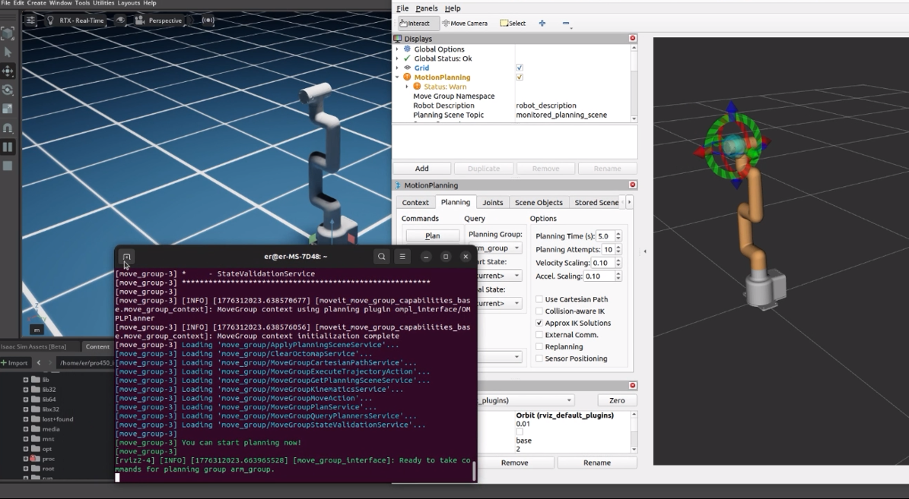

Planning in MoveIt moves the Isaac model.

To also drive the real arm during execution, in **another** terminal:

```bash
ros2 run pro450_isaac_moveit2_control isaac_sync_plan --ros-args -p ip:=192.168.0.232 -p port:=4500
```

Then Execute in MoveIt moves both Isaac and hardware.

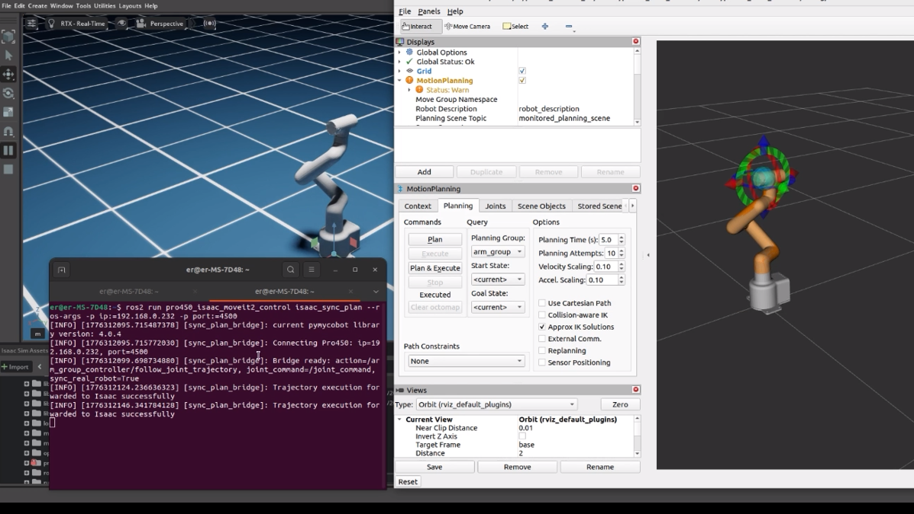

### Details

`isaac_moveit.launch.py` starts:

- `rsp.launch.py`  
- `static_virtual_joint_tfs.launch.py`  
- `move_group.launch.py`  
- `moveit_rviz.launch.py`  

`isaac_sync_plan.py` bridges:

- `/arm_group_controller/follow_joint_trajectory`  

to:

- `/joint_command`  

and optionally to the real robot.

## 10 Recommended workflows

### A: Isaac sim + ROS 2 only

1. Import Pro450 and configure the Action Graph in Isaac Sim  
2. Click `Play`  
3. Verify `/joint_states`  
4. Use `ros2 topic pub` or your own node to send `JointState` on `/joint_command`  

### B: Hardware + Isaac basics

1. Configure `/joint_command` in Isaac Sim  
2. Run `teleop_keyboard` or `simple_gui`  
3. Commands execute on hardware  
4. Mirror to Isaac via `/joint_command`  

### C: MoveIt 2 + Isaac + hardware

1. `Play` in Isaac Sim  
2. `isaac_moveit.launch.py`  
3. Plan in RViz  
4. `Execute`  
5. `isaac_sync_plan.py` converts the trajectory to `/joint_command`  
6. Isaac runs; optional hardware sync  

## 11 FAQ

### 1. No data on `/joint_command`

Expected. `ROS2 Subscribe Joint State` is a subscriber; it does not publish.  
You need a node that publishes to `/joint_command`.

### 2. Sim arm still; `/joint_states` OK

Check:

- `Articulation Controller` `targetPrim` → articulation root  
- Something actually publishes `/joint_command`  
- Physics Inspector open and fighting the controller  

### 3. MoveIt plans OK but Execute does not move Isaac

Check:

- You launched `isaac_moveit.launch.py`  
- `isaac_sync_plan.py` is running  
- Isaac is still in `Play`  
- `/joint_command` receives the bridged `JointState`  

### 4. Keyboard: `termios.error: (25, 'Inappropriate ioctl for device')`

Cause: not a real interactive TTY.

Fix:

- Use `teleop_keyboard.launch.py` from this repo  
- Or `ros2 run pro450_isaacsim teleop_keyboard` in a normal terminal  

### 5. Lag between hardware and Isaac

Common causes:

- `send_coords` does not carry direct joint targets  
- Sync waits on reported angles  
- Different control paths for robot vs Isaac  

This repo improves GUI coordinate mode with:

- Short polling of hardware angles  
- Resend on GUI refresh  

For tighter trajectory sync, consider:

- Higher-rate angle sampling  
- Interpolated trajectories  
- IK then direct Isaac joint targets  

## 12 Notes

- Prefer consistent topics for Isaac control:  
  - `/joint_states`  
  - `/joint_command`  
  - optional `/clock`  
- If multiple workspaces install the same package names, watch `source install/setup.bash` order so `get_package_share_directory()` does not resolve the wrong underlay.

---
