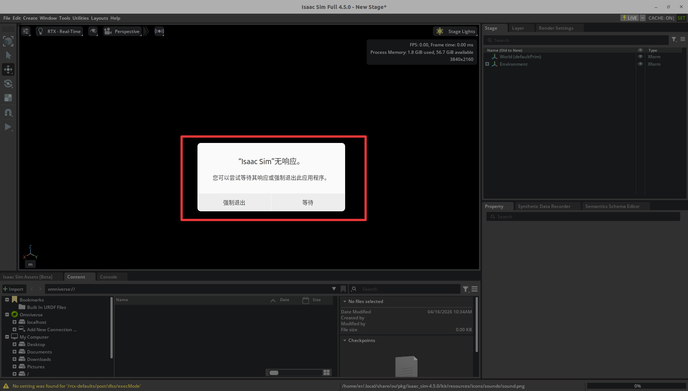

# mycobot450_isaacsim

`mycobot450_isaacsim` 是一个面向 **myCobot Pro 450** 的 Isaac Sim / ROS 2 / MoveIt 2 适配仓库，目标是打通以下几类基础能力：

- Pro450 URDF 模型与 ROS 2 描述包
- Isaac Sim 4.5.0 中的关节状态发布与关节命令订阅
- 真机与 Isaac 仿真联动
- 滑块、、模型跟随、GUI、键盘等基础控制方式
- MoveIt 2 与 Isaac Sim 的规划和执行桥接

## 1 快速开始

如果你第一次使用本仓库，建议按下面顺序操作：
1. 安装 ROS2 Humble、Isaac Sim 4.5.0 版本
2. 创建 ROS 2 工作空间并克隆本仓库
3. `colcon build` 编译所有功能包
4. 启动 Isaac Sim 4.5.0
5. 打开仓库中的 USD 场景
6. 在 Isaac Sim 中点击 `Play`
7. 根据需要启动基础控制节点或 MoveIt 2

最短路径示例：

```bash
mkdir -p ~/pro450_isaacsim_ws/src
cd ~/pro450_isaacsim_ws/src
git clone https://github.com/elephantrobotics/mycobot450_isaacsim.git

cd ~/pro450_isaacsim_ws
source /opt/ros/humble/setup.bash
colcon build
source install/setup.bash
```

## 2 使用前准备

在使用案例功能之前，请先确认以下硬件和环境准备齐全：

- **硬件设备**  
  - MyCobot Pro 450 机械臂  
  - 网线（用于连接机械臂与电脑）  
  - 电源适配器  
  - 急停开关（确保安全操作）

- **软件与环境**  
  - 系统：`Ubuntu 22.04` 
  - GPU：建议 NVIDIA 独显（本项目验证环境为 `RTX 3080`，显存为 `10GB`）
  - 已安装 `Python 3.10` 及以上版本  
  - 已安装 `ROS2 Humble` 版本
  - 已安装 `NVIDIA Isaac Sim 4.5.0` 及以上版本，参考： [Isaac Sim下载与安装](https://docs.isaacsim.omniverse.nvidia.com/4.5.0/installation/download.html)
  - 已安装 `pymycobot` 库（通过 `pip install pymycobot` 终端命令安装）  
  - 确保 MyCobot Pro 450 已正确接通电源，并处于待机状态  
  - **注意**：Pro 450 服务端会在设备上电后自动启动，无需手动操作  

- **网络配置**  
  - MyCobot Pro 450 默认 IP 地址：`192.168.0.232`  
  - 默认端口号：`4500`  
  - **注意**主机 端需要将本机网卡 IP 设置为 **同一网段**（例如 `192.168.0.xxx`，`xxx` 为 2~254 之间的任意数，且不能与机械臂冲突）。

  - 示例：  
    - 机械臂 IP：`192.168.0.232`  
    - 主机 IP：`192.168.0.100`  
    - 子网掩码：`255.255.255.0`
    - DNS服务器：`114.114.114.114`
  
  - **验证**：完成网络配置后，可在 主机 终端执行以下命令，若能成功返回数据包，则说明网络连接正常：  
  
    ```bash
    ping 192.168.0.232
    ```

---

## 3 仓库目录结构

```text
mycobot450_isaacsim/
├── README.md
├── LICENSE
├── mycobot_description/
│   ├── package.xml
│   ├── setup.py
│   ├── meshes/
│   └── urdf/
│       └── mycobot_pro_450/
│           └── mycobot_pro_450.urdf
├── pro450_isaacsim/
│   ├── package.xml
│   ├── setup.py
│   ├── config/
│   │   └── pro450_isaacsim.rviz
│   ├── launch/
│   │   ├── teleop_keyboard.launch.py
│   │   └── test.launch.py
│   └── pro450_isaacsim/
│       ├── slider_control.py
│       ├── follow_display.py
│       ├── simple_gui.py
│       ├── teleop_keyboard.py
│       └── usd/
│           └── mycobot_pro_450.usd
├── pro450_isaac_moveit2/
│   ├── package.xml
│   ├── CMakeLists.txt
│   ├── config/
│   └── launch/
│       ├── isaac_moveit.launch.py
│       ├── move_group.launch.py
│       ├── moveit_rviz.launch.py
│       ├── rsp.launch.py
│       ├── static_virtual_joint_tfs.launch.py
│       ├── demo.launch.py
│       └── ...
└── pro450_isaac_moveit2_control/
    ├── package.xml
    ├── setup.py
    └── pro450_isaac_moveit2_control/
        └── isaac_sync_plan.py
```

## 4 功能包说明

### `mycobot_description`

Pro450 的 ROS 2 描述包，提供：

- URDF 模型
- 相关 mesh 资源
- 供 `robot_state_publisher`、MoveIt 2、Isaac Sim 导入使用的机器人描述

关键文件：

- `mycobot_description/urdf/mycobot_pro_450/mycobot_pro_450.urdf`

### `pro450_isaacsim`

Isaac Sim 基础功能包，提供：

- 关节滑块联动：`slider_control.py`
- 跟随显示：`follow_display.py`
- GUI 控制：`simple_gui.py`
- 键盘控制：`teleop_keyboard.py` 、`teleop_keyboard.launch.py`

当前入口脚本：

- `ros2 run pro450_isaacsim slider_control`
- `ros2 run pro450_isaacsim follow_display`
- `ros2 run pro450_isaacsim simple_gui`
- `ros2 run pro450_isaacsim teleop_keyboard`
- `ros2 launch pro450_isaacsim teleop_keyboard.launch.py`

### `pro450_isaac_moveit2`

MoveIt 2 配置包，提供：

- SRDF / kinematics / joint limits / controllers 配置
- `move_group`
- `robot_state_publisher`
- RViz 启动
- Isaac Sim 专用 MoveIt 启动入口：`isaac_moveit.launch.py`

### `pro450_isaac_moveit2_control`

MoveIt 2 执行桥接包，提供：

- `isaac_sync_plan.py`

功能是把 MoveIt 的 `FollowJointTrajectory` 执行请求转成 Isaac Sim 可接受的：

- `/joint_command`
- `sensor_msgs/msg/JointState`

并可选同步下发到真实 Pro450 机械臂。

## 5 代码安装与编译

本仓库不是一个单独可直接运行的二进制项目，而是一个 **ROS 2 工作空间源码仓库**。  
因此，仓库克隆下来后，需要先放入工作空间并编译，之后才能通过 `ros2 run` / `ros2 launch` 使用。

推荐目录结构：

```text
~/pro450_isaacsim_ws/
├── src/
│   └── mycobot450_isaacsim/
├── build/
├── install/
└── log/
```

创建与编译步骤：

打开一个控制台终端(快捷键<kbd>Ctrl</kbd>+<kbd>Alt</kbd>+<kbd>T</kbd>)，在终端窗口依次输入以下命令：

```bash
mkdir -p ~/pro450_isaacsim_ws/src
cd ~/pro450_isaacsim_ws/src
git clone https://github.com/elephantrobotics/mycobot450_isaacsim.git

cd ~/pro450_isaacsim_ws
source /opt/ros/humble/setup.bash
colcon build
source install/setup.bash
```

如果只想编译某个包，例如：

```bash
cd ~/pro450_isaacsim_ws
source /opt/ros/humble/setup.bash
colcon build --packages-select pro450_isaacsim
colcon build --packages-select pro450_isaac_moveit2 pro450_isaac_moveit2_control
source install/setup.bash
```

## 6 Isaac Sim 启动与 USD 场景打开

### Isaac Sim 安装路径

当前项目的 Isaac Sim 安装路径示例为：

```bash
/home/er/.local/share/ov/pkg/isaac_sim-4.5.0
```

具体安装路径以实际为准。

### 启动 Isaac Sim

>> **具体安装目录以实际为准。**

进入安装目录后，通过官方启动脚本启动：

```bash
cd /home/er/.local/share/ov/pkg/isaac_sim-4.5.0
./isaac-sim.sh
```

**注意：** Isaac Sim 启动时间比较耗时（大约3分钟），后台需要渲染引擎、初始化核心模块，只需耐心等待即可。如果出现下面弹窗提示：



千万不要 `强制退出`，继续 `等待` 即可。 Isaac Sim 加载完成之后，会显示GPU等信息，如下图：


终端日志输出：

```bash
Isaac Sim Full App is loaded
```

如果你的系统已经在 shell 中正确配置了 ROS 2 环境，也可以在启动 Isaac Sim 前先执行：

```bash
source /opt/ros/humble/setup.bash
```

### 打开 USD 文件场景

本项目推荐直接打开仓库中的 USD 文件：

```text
pro450_isaacsim/pro450_isaacsim/usd/mycobot_pro_450.usd
```

如果仓库位于：

```text
~/pro450_isaacsim_ws/src/mycobot450_isaacsim
```

则完整路径通常类似：

```text
~/pro450_isaacsim_ws/src/mycobot450_isaacsim/pro450_isaacsim/pro450_isaacsim/usd/mycobot_pro_450.usd
```

在 Isaac Sim 中打开方式：

1. 启动 `./isaac-sim.sh`
2. 选择 `File -> Open`
3. 打开上面的 `mycobot_pro_450.usd`
4. 等待场景加载完成
5. 点击 `Play`

演示操作：

<video id="my-video" class="video-js" controls preload="auto" width="100%"
poster="" data-setup='{"aspectRatio":"16:9"}'>

<source src="./resources/video/isaacsim_import_usd.mp4">
</video>

## 7 Isaac Sim 配置说明

### 导入模型

本仓库有两种使用方式：

1. 使用 `mycobot_description` 中的 URDF 重新导入 Isaac Sim，生成自己的 USD（需要配置各关节的最大力矩值、阻尼系数、刚度系数： `Max Force`、`Damping`、`Stiffness` ）
2. 直接打开仓库中已经整理好的 USD：`pro450_isaacsim/pro450_isaacsim/usd/mycobot_pro_450.usd`

如果你只是想快速验证 ROS 2 / MoveIt 2 / 真机联动，建议优先直接打开现成 USD。

### Action Graph 推荐配置

建议至少包含以下节点：

- `ROS2 Context`
- `On Playback Tick`
- `Isaac Read Simulation Time`
- `ROS2 Publish Joint State`
- `ROS2 Subscribe Joint State`
- `Articulation Controller`
- 可选：`ROS2 Publish Clock`

推荐话题配置：

- 发布仿真关节状态：`/joint_states`
- 接收关节控制指令：`/joint_command`
- 可选发布时钟：`/clock`

### 关键 Prim Path 说明

这是本项目最容易踩坑的地方。

#### `ROS2 Publish Joint State`

通常应指向可以正确读取关节状态的 prim，例如：

- `/mycobot_pro450/base`

#### `Articulation Controller`

通常应指向 articulation root 所在 prim，而不是某个子 link，例如：

- `/mycobot_pro450/base`

如果填错，常见报错为：

- `Pattern '/mycobot_pro450' did not match any rigid bodies`
- `Provided pattern list did not match any articulations`
- `NoneType object has no attribute link_names`

### Physics Inspector 打开和注意事项

- 加载USD场景文件之后，选择 `Tools -> Physics -> Physics Inspector`

    

- 在插件窗口中，点击 `鼠标箭头` 符号

    

- 在弹窗中，选择 `Articulation`

    

- Physics Inspector 插件加载完成后，可以拖动关节进行仿真模型运动：

    

- 关闭 Physics Inspector插件：

    

`Physics Inspector` 可以用于手动拖动关节，但它和 `Articulation Controller` 都会写同一套 articulation。

因此：

- 只发布 `joint_states` 时，一般可以开 Inspector 手动拖动
- 使用 `Subscribe + Articulation Controller` 通过 ROS 控制时，建议关闭 Inspector

否则可能出现：

- `Simulation view object is invalidated and cannot be used again`
- `Articulation Controller` 异常
- 仿真控制冲突

## 8 基础功能使用

>> **注意：** **所有的功能案例使用都基于在Isaac Sim中已打开现有的USD场景。**，USD文件路径：`mycobot450_isaacsim/pro450_isaacsim/pro450_isaacsim/usd/mycobot_pro_450.usd`

### 1. 滑块跟随控制

<video id="my-video" class="video-js" controls preload="auto" width="100%"
poster="" data-setup='{"aspectRatio":"16:9"}'>

<source src="./resources/video/isaacsim_slider.mp4">
</video>

- 加载USD场景文件之后， 打开 `Physics Inspector` 插件工具

- 在 Isaac Sim 中点击 `Play`

- 用于把 Isaac / ROS 关节状态同步到真机。打开控制台终端运行命令：

```bash
ros2 run pro450_isaacsim slider_control --ros-args -p ip:=192.168.0.232 -p port:=4500
```


运行成功之后，通过拖动 `Inspector` 中的关节控制仿真模型运动，真实机器也会跟随运动。

**请注意：由于在命令输入的同时机械臂会移动到Isaac模型目前的位置，在您使用命令之前请确保 Isaac 中的模型没有出现穿模现象**

**不要在连接机械臂后做出快速拖动滑块的行为，防止机械臂损坏**


说明：

- 该节点订阅关节状态并调用 `send_angles`
- 适合做简单的关节拖动控制


### 2. 模型跟随显示

除了上面的控制，我们也可以让模型跟随真实的机械臂运动。

<video id="my-video" class="video-js" controls preload="auto" width="100%"
poster="" data-setup='{"aspectRatio":"16:9"}'>

<source src="./resources/video/isaacsim_follow_display.mp4">
</video>

- 加载USD场景文件之后（需要关闭 `Physics Inspector` 插件工具）

- 在 Isaac Sim 中点击 `Play`

- 把真机关节角度状态发布到 Isaac。打开控制台终端运行命令：

```bash
ros2 run pro450_isaacsim follow_display --ros-args -p ip:=192.168.0.232 -p port:=4500
```


运行成功后，根据终端输出信息，需要同时按住机器末端按钮拖拽关节移动，Isaac仿真模型将会跟随真实机械臂运动。

### 3. GUI 控制

在前者的基础上，这里还提供了一个简单的图形用户界面控制接口。

<video id="my-video" class="video-js" controls preload="auto" width="100%"
poster="" data-setup='{"aspectRatio":"16:9"}'>

<source src="./resources/video/isaacsim_gui.mp4">
</video>

- 加载USD场景文件之后（需要关闭 `Physics Inspector` 插件工具）

- 在 Isaac Sim 中点击 `Play`

- 把真机关节角度状态发布到 Isaac。打开控制台终端运行命令：

```bash
ros2 run pro450_isaacsim simple_gui --ros-args -p ip:=192.168.0.232 -p port:=4500
```

运行成功之后，然后在GUI界面输入相关角度和坐标信息，点击对应按钮，即可实现真实机器与仿真模型的同步运动


说明：

- 角度控制会直接向 Isaac 发布目标关节角
- 坐标控制会先发真机，再通过真机角度反馈同步到 Isaac
- 当前实现已补充“短轮询 + GUI 刷新补发”机制，以改进坐标控制同步

### 4. 键盘控制

在 `pro450_isaacsim` 包中添加了键盘控制功能，并在 IsaacSim 中实时同步。 该功能依赖于 Python Api，因此请确保与真正的机械臂连接。

<video id="my-video" class="video-js" controls preload="auto" width="100%"
poster="" data-setup='{"aspectRatio":"16:9"}'>

<source src="./resources/video/isaacsim_teleop_keyboard.mp4">
</video>

- 加载USD场景文件之后（需要关闭 `Physics Inspector` 插件工具）

- 在 Isaac Sim 中点击 `Play`

- 把真机关节角度状态发布到 Isaac。打开控制台终端运行命令：

```bash
ros2 launch pro450_isaacsim teleop_keyboard.launch.py ip:=192.168.0.232 port:=4500
```

运行成功后，会自动新开一个控制台终端，并输出类似信息：

```bash
Mycobot Teleop Keyboard Controller
---------------------------
Movimg options(control coordinations [x,y,z,rx,ry,rz]):
              w(x+)

    a(y-)     s(x-)     d(y+)

    z(z-) x(z+)

u(rx+)   i(ry+)   o(rz+)
j(rx-)   k(ry-)   l(rz-)

+/- : Increase/decrease movement step size

Other:
    1 - Go to init pose
    2 - Go to home pose
    3 - Resave home pose
    q - Quit
```

在该终端中，您可以通过命令行中的按键控制机械臂的状态并移动机械臂。

**注意：先输入2机械臂回到起始点之后，再进行其他坐标控制操作，终端会有如下类似提示：**

```bash
[WARN] [1758001794.385321]: Coordinate control disabled. Please press '2' first.
[INFO] [1758001804.552778]: Home pose reached. Coordinate control enabled.
[INFO] [1758001817.069637]: Home pose reached. Coordinate control enabled.
[WARN] [1758001836.301070]: Returned to zero. Press '2' to enable coordinate control.
[WARN] [1758001848.830702]: Coordinate control disabled. Please press '2' first.
[INFO] [1758001863.383565]: Home pose reached. Coordinate control enabled.
[WARN] [1758001933.596504]: Returned to zero. Press '2' to enable coordinate control.
[WARN] [1758001942.051899]: Coordinate control disabled. Please press '2' first.
```

说明：

- 键盘节点会直接连接 Pro450
- `send_angles` 控制会直接同步 Isaac
- `send_coords` 控制依赖真机反馈角度同步 Isaac
- Launch 中通过 `x-terminal-emulator -e` 启动，避免 `termios` 的 TTY 报错

## 9 MoveIt 2 与 Isaac Sim 联动

### 启动程序

<video id="my-video" class="video-js" controls preload="auto" width="100%"
poster="" data-setup='{"aspectRatio":"16:9"}'>

<source src="./resources/video/isaacsim_moveit2.mp4">
</video>

- 加载USD场景文件之后（需要关闭 `Physics Inspector` 插件工具）

- 点击 在 Isaac Sim 中点击 `Play`

- 加载 `moveit rviz` 页面。打开控制台终端运行命令：

```bash
ros2 launch pro450_isaac_moveit2 isaac_moveit.launch.py
```


此时在moveit页面中进行路径规划，Isaac里面的模型也会跟随规划运动。

如果需要规划执行时同步控制真机，新打开一个控制台终端运行命令：

```bash
ros2 run pro450_isaac_moveit2_control isaac_sync_plan --ros-args -p ip:=192.168.0.232 -p port:=4500
```

运行成功后，在moveit 页面中执行规划时，Isaac仿真模型、真实机械臂将会同步运动。


### 说明

`isaac_moveit.launch.py` 会启动：

- `rsp.launch.py`
- `static_virtual_joint_tfs.launch.py`
- `move_group.launch.py`
- `moveit_rviz.launch.py`

`isaac_sync_plan.py` 会执行桥接节点，把：

- `/arm_group_controller/follow_joint_trajectory`

转换成：

- `/joint_command`

并按需要同步到真机。

## 10 推荐使用流程

### 场景一：只做 Isaac 仿真 + ROS 2 基础联动

1. Isaac Sim 中导入 Pro450 模型并完成 Action Graph 配置
2. 点击 `Play`
3. 验证 `/joint_states` 正常发布
4. 用 `ros2 topic pub` 或自己的 ROS 2 节点向 `/joint_command` 发 `JointState`

### 场景二：真机 + Isaac 基础联动

1. Isaac Sim 中配置 `/joint_command`
2. 启动 `teleop_keyboard` 或 `simple_gui`
3. 真机执行命令
4. 通过 `/joint_command` 镜像到 Isaac

### 场景三：MoveIt 2 + Isaac + 真机

1. Isaac Sim 点击 `Play`
2. 启动 `isaac_moveit.launch.py`
3. 在 RViz 中规划
4. 点击 `Execute`
5. `isaac_sync_plan.py` 将轨迹转成 `/joint_command`
6. Isaac 执行，必要时同步真机

## 11 常见问题

### 1. `/joint_command` 没有数据

正常。`ROS2 Subscribe Joint State` 是订阅者，不会自己发布数据。  
需要有外部节点主动向 `/joint_command` 发布消息。

### 2. 仿真模型不动，但 `/joint_states` 正常

重点检查：

- `Articulation Controller` 的 `targetPrim` 是否指向 articulation root
- `/joint_command` 是否真的有发布者
- `Physics Inspector` 是否同时开着并与控制器冲突

### 3. MoveIt 规划能成功，但 Execute 不驱动 Isaac

重点检查：

- 是否使用了 `isaac_moveit.launch.py`
- 执行桥接节点 `isaac_sync_plan.py` 是否启动
- Isaac 是否仍在 `Play`
- `/joint_command` 是否能收到桥接后的 `JointState`

### 4. 键盘节点报错 `termios.error: (25, 'Inappropriate ioctl for device')`

原因：

- 节点没有绑定真实交互式终端

处理：

- 使用仓库中的 `teleop_keyboard.launch.py`
- 或单独在终端中 `ros2 run pro450_isaacsim teleop_keyboard`

### 5. 真机与 Isaac 同步有延迟

原因通常包括：

- `send_coords` 本身没有直接关节角目标
- 同步逻辑依赖真机角度反馈
- 真机和 Isaac 的控制链路不同步

当前仓库已针对 GUI 的坐标控制增加：

- 短轮询真机角度
- GUI 刷新中的补发同步

但如果要做到更严格的“过程同步”，仍建议进一步引入：

- 更高频角度采样
- 轨迹插补
- IK 解算后直接驱动 Isaac

## 12 备注

- 建议所有涉及 Isaac 控制的节点统一使用：
  - `/joint_states`
  - `/joint_command`
  - 可选 `/clock`
- 如果你的系统里存在多个工作空间都安装了同名包，注意 `source install/setup.bash` 的顺序，避免 `get_package_share_directory()` 解析到错误的 underlay。

---
